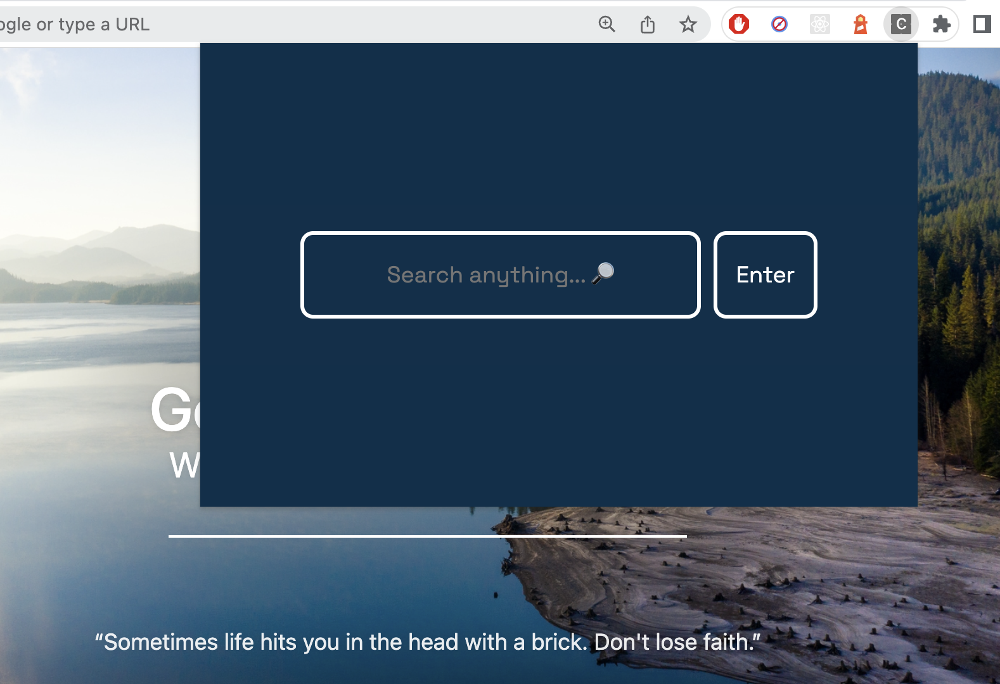

# Chrome Extension Challenge

## Criteria
A Chrome extension front-end that displays:
  1. a blank search bar on the shortcut (cmd +k) from any webpage, accepts input, and displays a blank card with smaller sub-cards inside it. Those sub-cards should be clickable to direct to a link, and 
  2. the newly opened page should KEEP showing the blank card in the exact state it was before clicking, meaning it is not a new blank page but the exact previous one imported to the new page.

Specifics:
- (A) Ensure that the shortcut does not conflict with any site that has a pre-existing use for that shortcut, e.g. Gmail (cmd + k is the shortcut for inserting a link while writing an email) - in these instances, give precedence to the web app.
- (B) Once a sub-card is clicked, and the URL opened - the main blank card should remain visible and keep showing on the newly opened URL in the exact state that it was prior to clicking the sub-card. E.g. if the extension was loaded whilst on Twitter and the user clicked on a sub-card from there, taking him to the pre-specified URL - the main blank card of the extension should remain visible on this new page in the same state as it was on Twitter.

## Implementation:
- ReactJS and Sass (BEM) to build and style this extension.
- The `manifest.json` file is the most important file of this application (it records crucial metadata, defines resources, declares permissions and identifies which files to run in the background and on the page. It must be in the root dir)
```json
{
  "manifest_version": 3,
  "name": "Chrome Extension Challenge",
  "description": "React Chrome Extension",
  "version": "1.0",
  "action": {
    "default_popup": "index.html",
    "default_title": "Open"
  },
  "permissions": [
    "scripting",
    "tabs",
    "activeTab",
    "webNavigation"
  ],
  "commands": {
    "run-extension": {
      "suggested_key": {
        "default": "Ctrl+K"
      },
      "description": "Run the extension on current page"
    }
  }
}
```

## Delivery (WIP)
#### Static front end
<p align="center">
  
</p>

#### Demo
<p align="center">
  
</p>

## Installation
1. Clone this repo then run:
    1.  `npm install`
    2. `npm run build`
2. Go to Chrome extensions ([chrome://extensions/](chrome://extensions/)) and make sure the 'Developer mode' is toggled ON.
3. Upload the `build` to Chrome Extensions (the `build` folder in this repo that was generated in step 1(ii)).
    - Click "Load unpacked", then select the `build` folder 
4. Pin the extension to the browser to test it out by clicking on it or via `Cmd+K` (or `Ctrl+K`)

#### Notes 
- Every time the codebase is updated, relaunch the extension by: 
    - (i) runnning `npm run build`, then
    - (ii) clicking the 'refresh' icon in the chrome extension
- The keyboard shortcut (`Cmd+K`) can be modified in the `manifest.json` `commands`, or manually in the Chrome Extensions ([chrome://extensions/shortcuts](chrome://extensions/shortcuts))

## Bugs/Challenges 🥴
- In the [live demo](#demo), it appears as though Criteria B is achieved (i.e. only the webpage 'background' changes, the extension card remains even after user clicks on a card link), however this will sometimes, given no changes/refreshes, not be the case, and the extension will disappear as a new link is navigated to 😅 (which seems to be the normal/expected behaviour)
    - Since the natural behaviour of a chrome extension is to [minimise upon external activity](https://stackoverflow.com/questions/10378477/keep-chrome-extension-popup-open-while-navigating-to-a-new-page) (i.e. extension link navigates user away to a new page), one solution(?) might be to log & detect in the browser `localStorage` whether user has the extension open or not, then once navigation completes, have the extension popup re-appear immediately in the same state (displaying search results etc...)
- Trying to figure out how to have the chrome extension styling 'float' on the page, and not be positionally tied to the extension icon in the top right ((i) `position: absolute`, (ii) making the width/height 100 viewport, (iii) `background: transparent` don't work due to in-built chrome defaults: i.e. the [max dims of an extension](https://stackoverflow.com/questions/8983165/how-can-i-expand-the-popup-window-of-my-chrome-extension) is apparently 600px height by 800px width), then also to generate another floating pop up (toast notification positioning) in the bottom right of the page 🤯